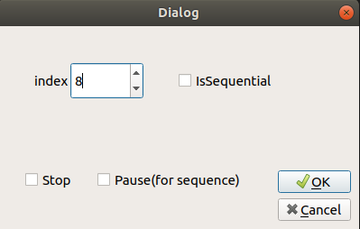
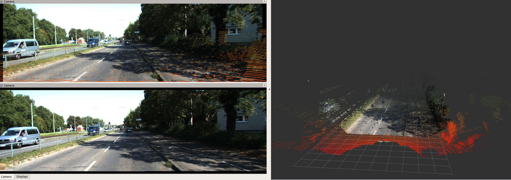

# Kitti Visualization

Ros package to visualize KITTI object data, raw data, and depth prediction data with RVIZ

## Getting Started:

Overwrite the folder names in the launch file to your data.

### Core Features:

- [x] KITTI object detection dataset support. 
- [x] KITTI raw data sequence support. 
- [x] KITTI depth prediction support. 
- [x] Stereo RGB cameras.
- [x] Filtered LiDAR, RGB point clouds.
- [x] Ground truth bounding boxes.
- [x] TF-tree (camera and LiDAR).
- [x] GUI control & ROS topic control.
- [ ] IMU tf trees.

### Beta Features:

Features that are supported with some tricks.

- [x] Additional labels allowed to visualize detection results along with GT bboxes.
- [x] Odometry supported in sequence reading and will publish to the TF tree.

## GUI

### User manual:

    index: integer selection notice do not overflow the index number (especially for kitti object dataset)

    isSequential: boolean flag to determine if we are using streaming data (for raw dataset)

    Stop: stop any data loading or processing of the visualization node.
    
    Pause: prevent pointer of the sequantial data stream from increasing, keep the current scene.

    Cancel: quit.

## Object Detection

Following the file structure of kitti object detection dataset. Point clouds, stereo images, object labels are loaded and published

## Raw Data & Depth Prediction Dataset

We support video-like streaming raw data. Depth Prediction dataset follows similar structure of raw data, thus can be visualized in RGB point clouds together(optionally). 

